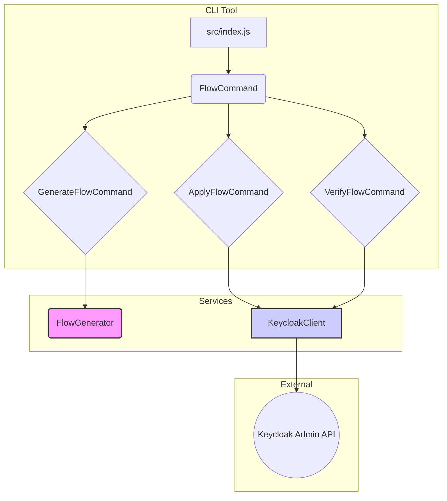

# Keycloak Auto-Configuration Tool Brownfield Enhancement Architecture

## 1. Introduction

This document outlines the architectural approach for enhancing the **Keycloak Auto-Configuration Tool** with **automated authentication flow management**. Its primary goal is to serve as the guiding architectural blueprint for AI-driven development of new features while ensuring seamless integration with the existing system.

**Relationship to Existing Architecture:**
This document supplements the existing project architecture by defining how new CLI commands and modules will integrate with the current `yargs`-based structure. Where conflicts arise between new and existing patterns, this document provides guidance on maintaining consistency while implementing the enhancements.

## 2. Existing Project Analysis

#### Current Project State

*   **Primary Purpose:** To automate Keycloak configuration, currently focused on identity provider setup. The enhancement will extend this to include authentication flows.
*   **Current Tech Stack:** Node.js ecosystem, `yargs` for the CLI framework. Interacts with the Keycloak Admin REST API.
*   **Architecture Style:** Standalone CLI application (polyrepo). Modular architecture is a goal (NFR4).
*   **Deployment Method:** Deployed as a CLI tool, likely via npm or a similar package manager.

#### Available Documentation

*   `docs/prd.md`: The Product Requirements Document for this enhancement.

#### Identified Constraints

*   All configuration changes must be performed exclusively through the official Keycloak Admin REST API.
*   Sensitive credentials must be managed via environment variables or a secure secrets management solution.
*   Generated configurations must be compatible with Keycloak versions 20.0.0 and later.
*   The tool must be a cross-platform CLI (Windows, macOS, Linux).

## 3. Enhancement Scope and Integration Strategy

#### Enhancement Overview

*   **Enhancement Type:** New feature addition to an existing CLI tool.
*   **Scope:** Add a new `flow` command with `generate`, `apply`, and `verify` subcommands to manage Keycloak authentication flows. This includes the logic for generating a specific "first broker login" flow with profile completion, domain validation, and account linking.
*   **Integration Impact:** Medium. This involves adding a new top-level command and corresponding modules, but leverages the existing CLI framework and Keycloak Admin API client.

#### Integration Approach

*   **Code Integration Strategy:** A new module will be created for the `flow` command, containing the logic for the `generate`, `apply`, and `verify` subcommands. This module will be registered as a new command in the main `yargs` configuration in `src/index.js`. The flow generation logic will be encapsulated in its own set of modules to support future expansion (NFR4).
*   **Database Integration:** Not applicable. The tool is stateless and interacts with the Keycloak API, not a database.
*   **API Integration:** The `apply` and `verify` commands will utilize the existing Keycloak Admin API client to create, update, and read authentication flow configurations in a specified realm.
*   **UI Integration:** Not applicable. This is a CLI tool.

#### Compatibility Requirements

*   **Existing API Compatibility:** The tool must not break compatibility with existing commands for identity provider setup. The new `flow` command is additive.
*   **Database Schema Compatibility:** Not applicable.
*   **UI/UX Consistency:** The new `flow` command and its subcommands must follow the existing CLI's conventions for command structure, arguments, and output formatting (NFR3).
*   **Performance Impact:** The `apply` command must complete within 30 seconds (NFR1).

## 4. Tech Stack

#### Existing Technology Stack

| Category | Current Technology | Version | Usage in Enhancement | Notes |
| :--- | :--- | :--- | :--- | :--- |
| Language | Node.js | >= 16.x (Assumed) | Core runtime for all new modules | Will continue to use the existing Node.js version. |
| CLI Framework | yargs | (Assumed latest) | To define and parse the new `flow` command and subcommands | New command will be integrated into the existing yargs setup. |
| API Client | Keycloak Admin Client | (Assumed existing) | To make REST API calls to the Keycloak server for `apply` and `verify` | Will reuse the existing client and its authentication mechanism. |

#### New Technology Additions

No new technologies are required for this enhancement. The existing stack is sufficient to meet all requirements.

## 5. Data Models and Schema Changes

#### New Data Models

This enhancement does not introduce any new data models that are stored or managed by the CLI tool itself. The primary "data" is the JSON representation of the Keycloak authentication flow, which is generated on-the-fly and sent to the Keycloak API. The structure of this JSON is dictated by the Keycloak Admin API's requirements for authentication flow configuration.

#### Schema Integration Strategy

*   **Database Changes Required:**
    *   **New Tables:** None.
    *   **Modified Tables:** None.
    *   **New Indexes:** None.
    *   **Migration Strategy:** Not applicable.
*   **Backward Compatibility:** Not applicable, as the tool is stateless and does not manage its own data schema.

## 6. Component Architecture

#### New Components

**`FlowCommand`**
*   **Responsibility:** Registers the new `flow` command with `yargs`. Delegates execution to the appropriate subcommand (`GenerateFlowCommand`, `ApplyFlowCommand`, `VerifyFlowCommand`).
*   **Integration Points:** Integrates with the main `yargs` instance in `src/index.js`.
*   **Key Interfaces:** `yargs.command()`
*   **Dependencies:**
    *   **Existing Components:** `Yargs` instance.
    *   **New Components:** `GenerateFlowCommand`, `ApplyFlowCommand`, `VerifyFlowCommand`.
*   **Technology Stack:** Node.js, yargs.

**`GenerateFlowCommand`**
*   **Responsibility:** Handles the `generate` subcommand. Orchestrates the flow generation by calling the `FlowGenerator` service. Outputs the resulting JSON to the console.
*   **Integration Points:** Called by `FlowCommand` when the `generate` subcommand is used.
*   **Key Interfaces:** `yargs` handler function.
*   **Dependencies:**
    *   **Existing Components:** None.
    *   **New Components:** `FlowGenerator`.
*   **Technology Stack:** Node.js, yargs.

**`ApplyFlowCommand`**
*   **Responsibility:** Handles the `apply` subcommand. Reads a flow configuration (either from a file or piped from `generate`) and uses the `KeycloakClient` to send it to the Keycloak server.
*   **Integration Points:** Called by `FlowCommand` when the `apply` subcommand is used.
*   **Key Interfaces:** `yargs` handler function.
*   **Dependencies:**
    *   **Existing Components:** `KeycloakClient`.
    *   **New Components:** None.
*   **Technology Stack:** Node.js, yargs.

**`VerifyFlowCommand`**
*   **Responsibility:** Handles the `verify` subcommand. Uses the `KeycloakClient` to fetch the authentication flow from the Keycloak server and checks if it matches the expected configuration.
*   **Integration Points:** Called by `FlowCommand` when the `verify` subcommand is used.
*   **Key Interfaces:** `yargs` handler function.
*   **Dependencies:**
    *   **Existing Components:** `KeycloakClient`.
    *   **New Components:** None.
*   **Technology Stack:** Node.js, yargs.

**`FlowGenerator`**
*   **Responsibility:** Contains the core logic for building the "first broker login" authentication flow JSON. It will have methods to add the required steps (profile completeness, domain validation, account linking) to the flow. Designed to be extensible for new flow types in the future.
*   **Integration Points:** Used by `GenerateFlowCommand`.
*   **Key Interfaces:** `generateFirstBrokerLoginFlow(config)`
*   **Dependencies:**
    *   **Existing Components:** None.
    *   **New Components:** None.
*   **Technology Stack:** Node.js.

#### Component Interaction Diagram

## 7. API Design and Integration

#### API Integration Strategy

*   **API Integration Strategy:** The tool will act as a client to the Keycloak Admin REST API. All interactions will be performed by making HTTPS requests to the relevant endpoints on the Keycloak server. The existing `KeycloakClient` will be used to handle authentication (obtaining an admin token) and making the API calls.
*   **Authentication:** The `KeycloakClient` is assumed to handle authentication by exchanging admin credentials for a bearer token, which is then used for all subsequent API requests. This aligns with the security requirement (NFR2) to handle credentials securely.
*   **Versioning:** The tool will target Keycloak versions 20.0.0 and later (NFR5). The API calls will be constructed to be compatible with the API versions corresponding to these Keycloak releases. No custom API versioning is needed on the client-side.

#### New API Endpoints

The following Keycloak Admin API endpoints will be used:

**Create Authentication Flow**
*   **Method:** `POST`
*   **Endpoint:** `/{realm}/authentication/flows`
*   **Purpose:** To create the main "first broker login" flow container.
*   **Integration:** Used by the `apply` command.

**Add Execution to Flow**
*   **Method:** `POST`
*   **Endpoint:** `/{realm}/authentication/flows/{flowAlias}/executions/execution`
*   **Purpose:** To add a new execution step (e.g., "Update Profile", "Detect Existing Broker User") to the flow.
*   **Integration:** Used by the `apply` command for each step in the generated flow.

**Create Authenticator Config**
*   **Method:** `POST`
*   **Endpoint:** `/{realm}/authentication/executions/{executionId}/config`
*   **Purpose:** To configure an execution, such as setting the approved domains for the "Email Domain Validator".
*   **Integration:** Used by the `apply` command for the script authenticator.

**Get Authentication Flows**
*   **Method:** `GET`
*   **Endpoint:** `/{realm}/authentication/flows`
*   **Purpose:** To retrieve all authentication flows in a realm to check if the "first broker login" flow already exists.
*   **Integration:** Used by the `verify` command and potentially by the `apply` command to determine whether to create or update a flow.

## 8. Source Tree

#### Existing Project Structure

`
/
├── src/
│   ├── index.js         # Main CLI entry point (yargs setup)
│   └── ...              # Existing commands and modules
└── ...
`

#### New File Organization

`
/
├── src/
│   ├── index.js         # Main CLI entry point (yargs setup)
│   ├── commands/
│   │   ├── flow/
│   │   │   ├── index.js         # Registers 'flow' command and subcommands
│   │   │   ├── generate.js      # Implements 'generate' subcommand
│   │   │   ├── apply.js         # Implements 'apply' subcommand
│   │   │   └── verify.js        # Implements 'verify' subcommand
│   │   └── ...              # Existing command modules
│   ├── services/
│   │   ├── keycloak-client.js # (Assumed) Existing client for Keycloak API
│   │   └── flow-generator.js  # New service for generating flow JSON
│   └── ...
└── ...
`

#### Integration Guidelines

*   **File Naming:** New files will follow the existing `kebab-case.js` naming convention.
*   **Folder Organization:** A new `flow` directory will be created under `src/commands` to encapsulate all functionality related to the new command. This follows a feature-based organization pattern, which keeps related code together.
*   **Import/Export Patterns:** The tool will continue to use CommonJS (`require`/`module.exports`) or ES Modules (`import`/`export`) based on the existing pattern in the project. The `flow` command module will export its `yargs` command configuration to be imported and used in `src/index.js`.

## 9. Infrastructure and Deployment Integration

#### Existing Infrastructure

*   **Current Deployment:** The tool is a standalone CLI application, likely distributed via a package manager like npm. Deployment involves publishing a new version of the package.
*   **Infrastructure Tools:** Standard Node.js build and packaging tools (e.g., npm, yarn).
*   **Environments:**
    *   **Local Development:** Developers run the tool directly from the source code.
    *   **CI/CD:** A CI/CD pipeline likely exists for running tests and publishing the package.
    *   **Production:** Users install and run the published package from the registry.

#### Enhancement Deployment Strategy

*   **Deployment Approach:** The enhancement will be deployed as part of a new version of the existing CLI tool. The standard `npm version` and `npm publish` (or equivalent) process will be followed.
*   **Infrastructure Changes:** No changes to the existing infrastructure are required. The new code will be bundled into the package just like the existing code.
*   **Pipeline Integration:** The existing CI/CD pipeline should be updated to include the new end-to-end tests for the `flow` command. These tests will need a running Keycloak instance (e.g., via Docker) to run against.

#### Rollback Strategy

*   **Rollback Method:** If a critical bug is found in the new version, a rollback can be achieved by unpublishing the faulty version from the package registry (if allowed) or, more commonly, by quickly publishing a new patch version that either fixes the bug or disables the new functionality.
*   **Risk Mitigation:** The new functionality is encapsulated in the `flow` command, so it is unlikely to affect existing commands. The primary risk is incorrect configuration being applied to a Keycloak realm. This is mitigated by the `verify` command and thorough end-to-end testing.
*   **Monitoring:** Monitoring will be based on user-reported issues and alerts from the package registry (if any).

## 10. Coding Standards

#### Existing Standards Compliance

*   **Code Style:** The new code will adhere to the existing code style. I will assume the project uses a common style guide like Prettier or ESLint, and I will follow the rules defined in the project's configuration files.
*   **Linting Rules:** All new code will pass the existing linting checks defined in the project (e.g., `.eslintrc.js`).
*   **Testing Patterns:** New unit and integration tests will follow the structure and patterns of existing tests. I will assume a testing framework like Jest is in use.
*   **Documentation Style:** Inline code comments and any new documentation will match the style of the existing codebase.

#### Enhancement-Specific Standards

No new, enhancement-specific standards are required. The goal is to make the new code indistinguishable from the existing code in terms of style and patterns.

#### Critical Integration Rules

*   **Existing API Compatibility:** The `KeycloakClient` must be used for all API interactions. Direct calls to the Keycloak API using other methods are not permitted.
*   **Database Integration:** Not applicable.
*   **Error Handling:** All interactions with the Keycloak API must include robust error handling. Errors returned from the API should be caught and presented to the user in a clear and informative way, as per NFR6. The CLI should exit with a non-zero status code on failure.
*   **Logging Consistency:** Any logging or console output must follow the existing format and verbosity levels of the CLI tool to ensure a consistent user experience (NFR3).

## 11. Testing Strategy

#### Integration with Existing Tests

*   **Existing Test Framework:** All new tests will be written using the project's existing test framework (assumed to be Jest).
*   **Test Organization:** New test files will be co-located with the source files (e.g., `flow-generator.test.js` next to `flow-generator.js`) or placed in a top-level `__tests__` directory, following the existing project structure.
*   **Coverage Requirements:** The new code will meet or exceed the existing code coverage requirements.

#### New Testing Requirements

**Unit Tests for New Components**
*   **Framework:** Jest.
*   **Location:** Co-located with source files.
*   **Coverage Target:** > 90% for the `FlowGenerator` service.
*   **Integration with Existing:** Unit tests will be added to the existing test suite and run as part of the same `npm test` command. The `FlowGenerator` will be tested in isolation, with no external dependencies.

**Integration Tests**
*   **Scope:** The integration tests will focus on the `*Command` components. They will test the yargs command configuration, argument parsing, and the interaction between the commands and the service layer (`FlowGenerator`, `KeycloakClient`).
*   **Existing System Verification:** The `KeycloakClient` will be mocked to simulate successful and unsuccessful API calls, ensuring the commands handle different API responses correctly.
*   **New Feature Testing:** We will test that calling `generate` with specific options results in the `FlowGenerator` being called with the correct parameters. We will also test that `apply` and `verify` call the appropriate methods on the `KeycloakClient`.

**End-to-End (E2E) Tests**
*   **Scope:** A new E2E test suite will be created for the `flow` command. This suite will execute the CLI tool as a child process and run it against a live, containerized Keycloak instance.
*   **Test Scenario:**
    1.  Start a clean Keycloak instance (e.g., using Docker).
    2.  Run the `apply` command to configure the "first broker login" flow.
    3.  Run the `verify` command to check that the flow was applied correctly.
    4.  (Optional) Use the Keycloak API directly to perform a more detailed validation of the created flow.
    5.  Tear down the Keycloak instance.
*   **Automated Regression Suite:** These E2E tests will be added to the CI/CD pipeline to act as a regression suite, ensuring that future changes do not break the core functionality.

## 12. Security Integration

#### Existing Security Measures

*   **Authentication:** The tool is assumed to use an existing `KeycloakClient` which authenticates to the Keycloak Admin API using an admin username and password to obtain a bearer token.
*   **Authorization:** The admin user credentials used by the tool must have the necessary permissions (`manage-realm`, `view-realm`) to manage authentication flows.
*   **Data Protection:** Sensitive credentials (admin username, password, client secrets) are managed via environment variables and are not hardcoded in the source code (NFR2).
*   **Security Tools:** The project likely uses standard tools like `npm audit` to check for vulnerabilities in dependencies.

#### Enhancement Security Requirements

*   **New Security Measures:** No new security mechanisms are required. The enhancement will operate within the existing security model.
*   **Integration Points:** The new `apply` and `verify` commands will use the existing `KeycloakClient`, inheriting its authentication and credential handling mechanisms. It is critical that these new commands do not introduce any new methods of handling credentials.
*   **Compliance Requirements:** There are no new compliance requirements.

#### Security Testing

*   **Existing Security Tests:** The existing test suite should be reviewed to ensure it does not contain any hardcoded credentials.
*   **New Security Test Requirements:**
    *   A test will be added to ensure the application fails gracefully with a clear error message if the required Keycloak admin credentials are not provided in the environment.
    *   The E2E test suite will be configured to pull credentials from a secure environment (e.g., CI/CD secrets) and pass them to the tool as environment variables, validating the secure credential handling mechanism.
*   **Dependency Scanning:** As part of the CI/CD pipeline, `npm audit` will be run to ensure no new dependencies with known vulnerabilities are introduced.
