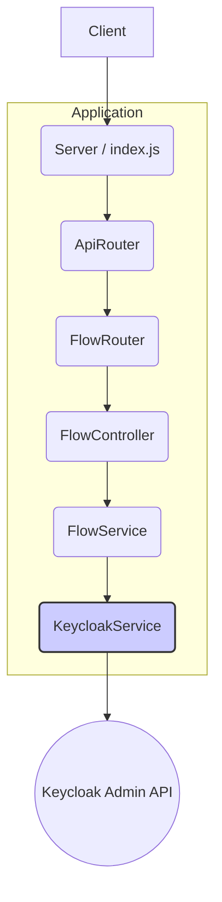

# Keycloak Configuration Server Architecture

## 1. Introduction

This document outlines the architectural approach for the **Keycloak Configuration Server**. Its primary goal is to serve as the guiding architectural blueprint for developing a web server that, while currently non-functional, is intended to manage Keycloak configurations. This document will replace the previous, inaccurate architecture that described a CLI tool.

**Relationship to Existing Architecture:**
This document establishes the foundational architecture for the Express.js web server based on the project's dependencies. It is the source of truth for the server's structure and patterns.

## 2. Existing Project Analysis

#### Current Project State

*   **Primary Purpose:** The project is intended to be an Express.js web server for managing Keycloak configurations. Currently, it is a non-functional skeleton.
*   **Current Tech Stack:** Node.js, Express.js, with middleware for security (helmet, cors) and JWT authentication (express-jwt, jwks-rsa).
*   **Architecture Style:** Standalone backend service (polyrepo).
*   **Deployment Method:** To be deployed as a standard Node.js web application.

#### Available Documentation

*   `docs/prd.md`: Contains the high-level goals for the project, though it is written from the perspective of a CLI tool. The core requirements for automating Keycloak flow configuration are still relevant.
*   `docs/architecture/tech-stack.md`: Documents the intended technology stack.
*   `docs/architecture/source-tree.md`: Outlines the intended source tree.
*   `docs/architecture/coding-standards.md`: Provides coding standards.

#### Identified Constraints

*   The server must interact with the Keycloak Admin REST API to perform its functions.
*   Sensitive credentials must be managed via environment variables.
*   The solution must be compatible with Keycloak versions 20.0.0 and later.

## 3. Enhancement Scope and Integration Strategy

#### Enhancement Overview

*   **Enhancement Type:** Initial implementation of a backend service.
*   **Scope:** To build a functional Express.js server that can receive API requests, interact with the Keycloak Admin API, and manage authentication flows as described in the PRD. This includes creating the necessary directory structure, setting up the Express server, and creating initial routes and services.
*   **Integration Impact:** High. This involves creating the entire application structure from scratch.

#### Integration Approach

*   **Code Integration Strategy:** A standard feature-based or layer-based structure will be created (e.g., `src/routes`, `src/controllers`, `src/services`). An `index.js` file will be created to initialize and start the Express server. A `keycloak-service.js` will be created to encapsulate all interactions with the Keycloak Admin API.
*   **Database Integration:** Not applicable for the initial setup. The service will be stateless.
*   **API Integration:** The `keycloak-service.js` will be responsible for all communication with the external Keycloak Admin REST API.
*   **UI Integration:** Not applicable. This is a backend service.

#### Compatibility Requirements

*   **Existing API Compatibility:** Not applicable, as no internal APIs exist yet.
*   **Database Schema Compatibility:** Not applicable.
*   **UI/UX Consistency:** Not applicable.
*   **Performance Impact:** The server should respond to API requests within a reasonable timeframe (< 500ms for most requests, excluding the latency of the Keycloak API itself).

## 4. Tech Stack

#### Existing Technology Stack

| Category | Current Technology | Version | Usage in Enhancement | Notes |
| :--- | :--- | :--- | :--- | :--- |
| Language | Node.js | >=20.0.0 | Core runtime for the server | Specified in `package.json`. |
| Web Framework | Express | ^4.18.2 | The core framework for the web server | Will be used to define routes and middleware. |
| Security | Helmet | ^7.1.0 | Provides security-related HTTP headers | Will be used as a standard middleware. |
| Security | CORS | ^2.8.5 | Manages Cross-Origin Resource Sharing | Will be used as a standard middleware. |
| Authentication | express-jwt | ^8.4.1 | Middleware for validating JSON Web Tokens | To be used for securing API endpoints. |
| Authentication | jwks-rsa | ^3.1.0 | Retrieves RSA signing keys from a JWKS endpoint | Works with `express-jwt` to validate tokens. |
| Environment | dotenv | ^16.3.1 | Manages environment variables | For loading configuration from a `.env` file. |

#### New Technology Additions

No new technologies are required to build the foundational server. The existing dependencies are sufficient.

## 5. Data Models and Schema Changes

#### New Data Models

The service will be stateless for the initial implementation. It will not have its own database or persistent data models. The primary data structures it will handle are:

1.  **API Request Payloads:** JSON objects sent from clients to the server's API endpoints.
2.  **Keycloak API Payloads:** JSON objects constructed by the server to be sent to the Keycloak Admin API. The schema for these is defined by Keycloak.

#### Schema Integration Strategy

*   **Database Changes Required:**
    *   **New Tables:** None.
    *   **Modified Tables:** None.
    *   **New Indexes:** None.
    *   **Migration Strategy:** Not applicable.
*   **Backward Compatibility:** Not applicable, as the service is stateless.

## 6. Component Architecture

#### New Components

**`Server` (`index.js`)**
*   **Responsibility:** Initializes the Express application, applies top-level middleware (helmet, cors, etc.), registers the main router, and starts the HTTP server.
*   **Integration Points:** The main entry point of the application.
*   **Key Interfaces:** `app.listen()`, `app.use()`.
*   **Dependencies:** `ApiRouter`.
*   **Technology Stack:** Node.js, Express.

**`ApiRouter` (`src/routes/index.js`)**
*   **Responsibility:** The main router for the application. It will delegate requests to feature-specific routers (e.g., `FlowRouter`). It can also handle API versioning.
*   **Integration Points:** Used by the `Server` component.
*   **Key Interfaces:** `express.Router()`.
*   **Dependencies:** `FlowRouter`.
*   **Technology Stack:** Express.

**`FlowRouter` (`src/routes/flow.js`)**
*   **Responsibility:** Handles all routes related to authentication flows (e.g., `POST /flows`, `GET /flows/:id`). It delegates the business logic for each route to the `FlowController`.
*   **Integration Points:** Used by the `ApiRouter`.
*   **Key Interfaces:** `router.post()`, `router.get()`.
*   **Dependencies:** `FlowController`.
*   **Technology Stack:** Express.

**`FlowController` (`src/controllers/flow.js`)**
*   **Responsibility:** Handles the request and response for a specific route. It calls the `FlowService` to perform the business logic and then sends the response to the client.
*   **Integration Points:** Used by the `FlowRouter`.
*   **Key Interfaces:** Express middleware functions `(req, res, next)`.
*   **Dependencies:** `FlowService`.
*   **Technology Stack:** Node.js.

**`FlowService` (`src/services/flow.js`)**
*   **Responsibility:** Contains the core business logic for managing authentication flows. It transforms client requests into the format required by the `KeycloakService` and orchestrates the calls.
*   **Integration Points:** Used by the `FlowController`.
*   **Key Interfaces:** `createFlow(data)`, `getFlow(id)`.
*   **Dependencies:** `KeycloakService`.
*   **Technology Stack:** Node.js.

**`KeycloakService` (`src/services/keycloak.js`)**
*   **Responsibility:** A dedicated service that encapsulates all communication with the external Keycloak Admin API. It handles authentication with Keycloak and making the raw API calls.
*   **Integration Points:** Used by the `FlowService`.
*   **Key Interfaces:** `createFlowInKeycloak(flowJson)`, `getFlowsFromKeycloak()`.
*   **Dependencies:** None.
*   **Technology Stack:** Node.js, a library like `axios` or `node-fetch` for making HTTP requests.

#### Component Interaction Diagram



## 7. API Design and Integration

#### API Integration Strategy

*   **API Integration Strategy:** The primary function of this service is to provide a RESTful API for managing Keycloak authentication flows. The API will be the main interface for clients. Internally, it will act as a client to the Keycloak Admin REST API, abstracting away the complexity of the Keycloak API.
*   **Authentication:** API endpoints will be secured using JWT-based authentication. The `express-jwt` and `jwks-rsa` middleware will be used to validate tokens issued by a trusted identity provider (which could be Keycloak itself).
*   **Versioning:** The API will be versioned using a path prefix, e.g., `/api/v1`.

#### New API Endpoints

**Generate and Apply Flow**
*   **Method:** `POST`
*   **Endpoint:** `/api/v1/realms/{realmName}/flows`
*   **Purpose:** To generate and apply a new "first broker login" authentication flow to a specified realm.
*   **Request Body:**
    ```json
    {
      "flowType": "first-broker-login",
      "config": {
        "approvedDomains": ["example.com", "test.com"]
      }
    }
    ```
*   **Response (Success):**
    ```json
    {
      "status": "success",
      "message": "Authentication flow 'first-broker-login' applied successfully to realm 'myrealm'."
    }
    ```

**Verify Flow**
*   **Method:** `GET`
*   **Endpoint:** `/api/v1/realms/{realmName}/flows/{flowAlias}/verify`
*   **Purpose:** To verify that a specific authentication flow in a realm is configured correctly.
*   **Response (Success):**
    ```json
    {
      "status": "verified",
      "checks": [
        { "check": "Flow exists", "status": "passed" },
        { "check": "Profile Completeness step found", "status": "passed" },
        { "check": "Account Linking step found", "status": "passed" },
        { "check": "Domain Validation step found", "status": "passed" }
      ]
    }
    ```

## 8. Source Tree

#### Existing Project Structure

```plaintext
/
├── package.json
└── ...
```

#### New File Organization

```plaintext
/
├── src/
│   ├── controllers/
│   │   └── flow.js
│   ├── routes/
│   │   ├── index.js
│   │   └── flow.js
│   ├── services/
│   │   ├── flow.js
│   │   └── keycloak.js
│   └── middleware/
│       └── auth.js      # JWT validation middleware
├── .env
├── .env.example
├── index.js             # Server entry point
└── package.json
```

#### Integration Guidelines

*   **File Naming:** Files will be named using `kebab-case.js`.
*   **Folder Organization:** The source code will be organized by layer (`controllers`, `routes`, `services`, `middleware`). This is a standard and effective pattern for Express.js applications that provides a clear separation of concerns.
*   **Import/Export Patterns:** The project will use ES Modules (`import`/`export`) as is standard for modern Node.js applications.

## 9. Infrastructure and Deployment Integration

#### Existing Infrastructure

*   **Current Deployment:** Not applicable, as the project is not yet deployed.
*   **Infrastructure Tools:** The project is set up to be run locally with Node.js and `nodemon`.
*   **Environments:** A local development environment is the only defined environment.

#### Enhancement Deployment Strategy

*   **Deployment Approach:** The application will be packaged into a Docker container for deployment. This will ensure consistency between the development, staging, and production environments. The container will be deployed to a container orchestration platform (e.g., Kubernetes, AWS ECS) or a Platform-as-a-Service (PaaS) provider (e.g., Heroku, Render).
*   **Infrastructure Changes:**
    *   A `Dockerfile` will be created to define the container image.
    *   CI/CD pipelines will be set up to automatically build and push the Docker image to a container registry (e.g., Docker Hub, AWS ECR).
    *   Deployment scripts or configurations (e.g., Kubernetes manifests, `docker-compose.yml`) will be created to run the container in different environments.
*   **Pipeline Integration:** The CI/CD pipeline will be configured to:
    1.  Install dependencies.
    2.  Run linting and unit tests.
    3.  Build the Docker image.
    4.  Push the image to the container registry.
    5.  Deploy the image to the staging/production environment.

#### Rollback Strategy

*   **Rollback Method:** Rollbacks will be handled by deploying a previous, stable version of the Docker image. This is a standard and effective rollback strategy for containerized applications.
*   **Risk Mitigation:** Deployments should be made to a staging environment for testing before being promoted to production. Automated tests in the CI/CD pipeline will catch many issues before they reach production.
*   **Monitoring:** The application should be configured to output structured logs (e.g., JSON). A logging service (e.g., Datadog, Logz.io) will be used to collect and monitor these logs. Health check endpoints (`/healthz`) will be created for automated monitoring by the orchestration platform.

## 10. Coding Standards

#### Existing Standards Compliance

*   **Code Style:** The project will adopt a consistent code style enforced by a tool like Prettier.
*   **Linting Rules:** ESLint will be used to enforce code quality and catch common errors. A standard configuration (e.g., `eslint:recommended` or Airbnb's style guide) will be used as a baseline.
*   **Testing Patterns:** Unit tests will be written using a framework like Jest. Tests will be organized in a `__tests__` directory or co-located with the source files.
*   **Documentation Style:** JSDoc will be used for documenting functions, classes, and modules.

#### Enhancement-Specific Standards

*   **Asynchronous Code:** `async/await` will be used for all asynchronous operations. Raw promises and callbacks should be avoided.
*   **Error Handling:** A centralized error handling middleware will be created in Express. Controllers should use this middleware to propagate errors, rather than implementing custom error handling logic in each route.

#### Critical Integration Rules

*   **External API Interaction:** All communication with the Keycloak Admin API must be contained within the `KeycloakService`. No other part of the application should make direct calls to this API.
*   **Database Integration:** Not applicable.
*   **Environment Variables:** All configuration, especially sensitive values, must be managed through environment variables and accessed via a configuration module. Nothing should be hardcoded.
*   **Logging Consistency:** A logging library (e.g., Winston, Pino) should be used to produce structured JSON logs. All log messages should follow a consistent format.

## 11. Testing Strategy

#### Integration with Existing Tests

*   **Existing Test Framework:** Not applicable, as no tests exist yet. Jest will be adopted as the primary testing framework.
*   **Test Organization:** Test files will be named `*.test.js` and will be co-located with the source files they are testing.
*   **Coverage Requirements:** A minimum of 80% code coverage will be enforced for all new code.

#### New Testing Requirements

**Unit Tests for New Components**
*   **Framework:** Jest.
*   **Scope:** Unit tests will focus on individual services and controllers. The `FlowService` will be tested to ensure it correctly transforms data and calls the `KeycloakService`. The `KeycloakService` will be tested with a mocked HTTP client to ensure it makes the correct API calls.
*   **Coverage Target:** > 80%.

**Integration Tests**
*   **Scope:** Integration tests will test the application at the API level. They will use a library like `supertest` to make real HTTP requests to the running Express application.
*   **Existing System Verification:** The `KeycloakService` will be mocked at this level to isolate the application from the external Keycloak API. This will allow us to test the full application stack (routing, controllers, services) without the need for a running Keycloak instance.
*   **New Feature Testing:** We will write integration tests for each API endpoint, covering success cases, error cases (e.g., invalid input), and authentication/authorization.

**End-to-End (E2E) Tests**
*   **Scope:** E2E tests will be created to test the full lifecycle of the application's interaction with a real Keycloak instance.
*   **Test Scenario:**
    1.  Start the Express server.
    2.  Start a clean Keycloak instance (e.g., using Docker).
    3.  Make an API call to the server's `POST /api/v1/realms/{realmName}/flows` endpoint.
    4.  Verify that the server responds with a success message.
    5.  Use the Keycloak API directly (or the server's `GET` endpoint) to verify that the authentication flow was actually created in the Keycloak instance.
    6.  Tear down the Keycloak instance and the server.
*   **Automated Regression Suite:** These E2E tests will be run as part of the CI/CD pipeline before any deployment to production.

## 12. Security Integration

#### Existing Security Measures

*   **Authentication:** Not applicable, as the service is not yet implemented.
*   **Authorization:** Not applicable.
*   **Data Protection:** The `package.json` includes `dotenv`, indicating the intention to handle secrets via environment variables.
*   **Security Tools:** The `package.json` includes `helmet`, a tool for securing Express apps by setting various HTTP headers.

#### Enhancement Security Requirements

*   **New Security Measures:**
    *   **API Authentication:** All API endpoints (except for a public `/healthz` endpoint) will be protected. JWT-based authentication will be implemented using `express-jwt` and `jwks-rsa`.
    *   **Input Validation:** All incoming request bodies and parameters will be validated using a library like `express-validator` or `zod` to prevent injection attacks and other malicious inputs.
    *   **Secure Headers:** The `helmet` middleware will be used to set secure HTTP headers, such as `Content-Security-Policy`, `Strict-Transport-Security`, and `X-Content-Type-Options`.
*   **Integration Points:** A global authentication middleware will be created and applied to the main API router to protect all endpoints.
*   **Compliance Requirements:** There are no specific compliance requirements at this time.

#### Security Testing

*   **Security Test Requirements:**
    *   Integration tests will be written to verify that unauthenticated requests to protected endpoints are rejected with a `401 Unauthorized` status code.
    *   Integration tests will be written to verify that requests with invalid or malformed input are rejected with a `400 Bad Request` status code.
    *   As part of the CI/CD pipeline, `npm audit` will be run to scan for vulnerabilities in third-party dependencies.
*   **Penetration Testing:** Manual or automated penetration testing is recommended before the first production deployment.